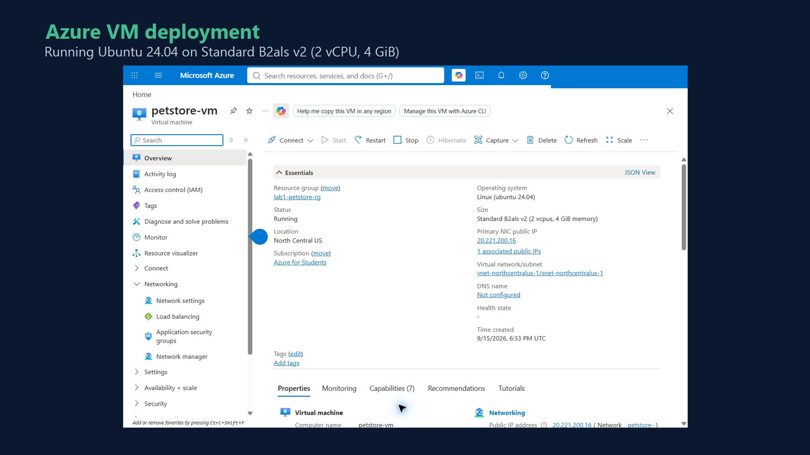
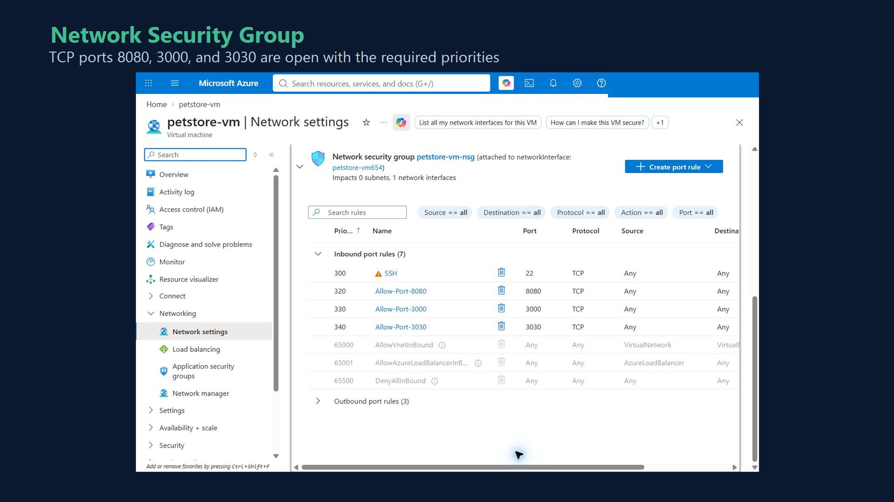
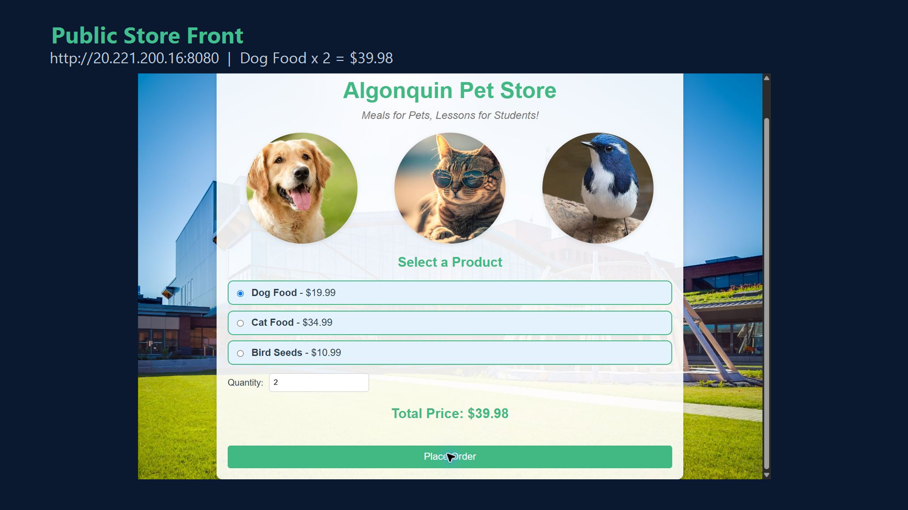

# CST8915 Lab 1: Algonquin Pet Store on Azure VM

**Student Name:** Chukwudubem Chukwurah
**Student ID:** 041285726
**Course:** CST8915 Full-stack Cloud-native Development
**Semester:** Fall 2026

## Demo Video

🎥 [Watch the Unlisted Continuous CDP Browser Recording](https://youtu.be/447cmxTDQpM)

## Deployment Evidence

### Azure VM

The VM is running Ubuntu 24.04 on a Standard B2als v2 instance with 2 vCPUs and 4 GiB of memory. This matches the capacity of the README's Standard B2s example.

### Network Security Group

The required TCP ports are open with the assigned priorities: 8080 for the Store Front, 3000 for the Order Service, and 3030 for the Product Service.

### Public Store Front and Order Test

The Store Front loaded from the Azure VM's public IP. Selecting two Dog Food units produced the expected $39.98 total, and the submitted order was confirmed in the durable RabbitMQ queue.

## Technical Explanations

### Order Service (Node.js)

The Order Service is the application’s order-entry API. It uses Node.js with Express to expose `POST /orders` on port 3000, parses the incoming JSON request, and serializes the order before sending it to RabbitMQ. CORS is enabled because the Vue store front is served separately and must be able to call the API from a browser.

Within the microservices architecture, this service separates accepting an order from processing it. It publishes each order to the durable `order_queue` through AMQP. The message is marked persistent and mandatory, and the service waits for RabbitMQ’s confirmation before returning `Order received`. This design allows the order API and a future order-processing consumer to operate independently while RabbitMQ buffers the work reliably.

### Product Service (Rust)

The Product Service provides the store’s product catalogue. It is written in Rust using the Warp web framework and Tokio asynchronous runtime. The service exposes `GET /products` on port 3030 and returns JSON containing the product IDs, names, and prices. It accepts cross-origin GET requests so the separately hosted store front can retrieve the catalogue.

This service is independent of the ordering workflow and is responsible only for product information. The Vue client calls it when the page loads, then uses the returned prices to calculate totals. It binds to `0.0.0.0` so it can receive traffic through the Azure VM network interface when port 3030 is allowed by the network security group.

### Store Front (Vue.js)

The Store Front is the customer-facing Vue.js application served on port 8080. It retrieves products from the Product Service, lets the user select a product and quantity, and calculates the total with a Vue computed property. The order button remains disabled until the selection and quantity are valid.

When the user places an order, the store front sends a JSON request to the Order Service on port 3000. For the Azure deployment, both API URLs are changed from `localhost` to the VM’s public IP because the browser runs on the user’s computer rather than inside the VM. The store front therefore coordinates the two backend services without combining their responsibilities.

## Challenges and Learnings

The Azure for Students subscription initially restricted several VM regions and did not offer the README’s example Standard B2s size. The deployed Standard B2als v2 instance is an x64 burstable VM with the same required capacity of 2 vCPUs and 4 GiB RAM. Azure recommended North Central US for the selected instance type.

The deployment also reinforced why service startup order matters. RabbitMQ must be available before the Order Service can publish, while the Product Service must be available before the Store Front can display its catalogue. Testing the complete request path showed how the browser, REST APIs, and message queue participate in one order without turning the system into a single application.

## Acknowledgments

- Instructor repository and lab instructions: https://github.com/ramymohamed10/26F_Lab1_CST8915
- OpenAI Codex assisted with deployment automation, code analysis, testing, and preparation of this report. The student reviewed the deployed system and submission materials.
